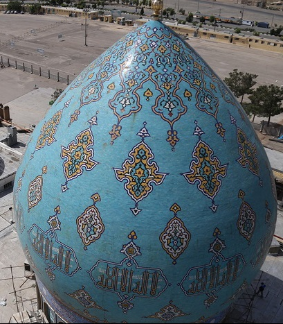

# Dome-3D-Reconstruction
Use GUI to locate your image and run the program. 

## GUI

Use the command below on Matlab command window to run the GUI:

```bash
GUI
```


## Performance

### Input

Specify path to your image (you can use example images in images file) and the method of reconstruction.




### Output


and finally:


## References
<a id="1">[1]</a> 
Jia, W., Yue, Y., Fernstrom, J. D., Zhang, Z., Yang, Y., & Sun, M.(2012). 
3D Localization of Circular Feature in 2D Image and Application to Food Volume Estimation.

