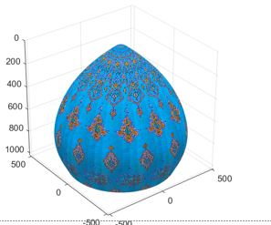

# Dome-3D-Reconstruction
Use GUI to locate your image and run the program. 

## GUI

Use the command below on Matlab command window to run the GUI:

```bash
GUI
```


## Output

Specify path to your image (you can use example images in images file) and the method of reconstruction.




